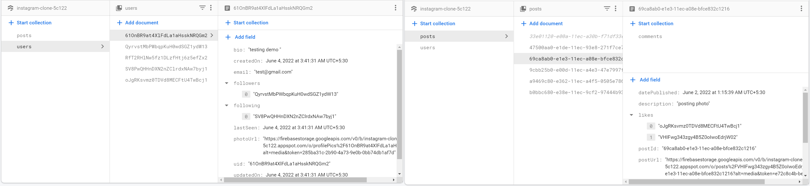

# Instagram Clone

Instagram Clone with Flutter 3 and Firebase. This Project focus towards Multiplform feature of flutter, and Responsive UI. 

- Android, iOS & Web(stable)
- Macos (issue: image_picker not available)
- Windows and Linus 🚧 (inprogress: Firebase not supported using Firedart)


## Features
- Feed Screen
  - View Post, with realtime UI upadtes with stream builder
  - Live Comments on post
  - Delete Post
  - Heart Animation on liking
- Search Screen
  - Search screen showing all images except your own
  - Search based on usernames
- Image Upload Screen
  - Upload Image with Description
- Profile Screen
  - Follow/Unfollow feature
  - Grid View of iamges
  


## Todo
- [ ] One-One Chat Screen
- [ ] Edit User details
- [ ] Google SignIn
- [ ] Video sharing and Tagging Support
- [ ] Unit Testing
- [ ] Adding features to Responsive View
- [ ] Notification Screen
- [ ] Github Action Pipeline
- [ ] Windows and Linux Support

## Getting Started

### 1. [Setup Flutter](https://flutter.io/setup/)

### 2. Clone the repo

```sh
$ git clone https://github.com/mohak1283/Instagram-Clone
$ cd Instagram-Clone/
```

### 3. Setup the firebase app

#### 1. You'll need to create a Firebase instance. Follow the instructions at https://console.firebase.google.com.
#### 2. Once your Firebase instance is created, you'll need to enable Eamil & password authentication.


#### 3. Enable the Firebase Database
* Go to the Firebase Console
* Click "Database" in the left-hand menu
* Click the Cloudstore "Create Database" button
* Select "Start in test mode" and "Enable"
* Go to the rules tab and remove line no: 6

#### 4. Enable Firebase Storage: Do the same as above 

#### 5. (skip if not running on Android)

* Create an app within your Firebase instance for Android, with package name com.example.instagram_clone
* Run the following command to get your SHA-1 key:

```
keytool -exportcert -list -v \
-alias androiddebugkey -keystore ~/.android/debug.keystore
```

* In the Firebase console, in the settings of your Android app, add your SHA-1 key by clicking "Add Fingerprint".
* Follow instructions to download google-services.json
* place `google-services.json` into `/android/app/`.


#### 6. (skip if not running on iOS)

* Create an app within your Firebase instance for iOS, with your app package name
* Follow instructions to download `GoogleService-Info.plist`
* Open XCode, right click the Runner folder, select the "Add Files to 'Runner'" menu, and select the `GoogleService-Info.plist` file to add it to /ios/Runner in XCode (*Use XCode for ths=is other way doesn't make sure the configuration*)
* Make sure to add these in your `/ios/Runner/Info.plist` in side `<dict>` block to acces the camara and gallery
```
    <key>NSPhotoLibraryUsageDescription</key>
	<string>Photo Library Usage</string>
	<key>NSCameraUsageDescription</key>
	<string>Camara Usage</string>
	<key>NSMicrophoneUsageDescription</key>
	<string>Microphone Usage</string>
```
#### 7. (skip if not running on macos)
* Follow instructions to download `GoogleService-Info.plist`
* Put it inside `/macos/`

Double check install instructions for both
   - Google Auth Plugin
     - https://pub.dartlang.org/packages/firebase_auth
   - Firestore Plugin
     -  https://pub.dartlang.org/packages/cloud_firestore
  
## Firebase Firestore & Firebase Storage Structure



```
Firebase Storage Schema is simple, 
- posts---Folder(User ID as name)---images inside
- profileIamge---Images(User ID as name)
```

## Want to Contribute ?

Awesome! If you want to contribute to this project, you're always welcome!
Have any questions, doubts or want to present your opinions, views? You're always welcome. You can mail me at <b>debanshudatta123@gmail.com</b> or make an issue.
Looking for contributors! Don't be shy. 😁 Feel free to open issues/pull requests to help me improve this project.

- When reporting a new Issue, make sure to attach Screenshots, Videos or GIFs of the problem you are reporting.
- When submitting a new PR, make sure tests are all green. Write new tests if necessary.

## Contributors

- [Debanshu Datta](https://github.com/Debanshu777)

## License
The Instagram name, artwork, trademark are all property of Meta Inc. This project is provided for educational purposes only. It is not affiliated with and has not been approved by Snap Inc.
